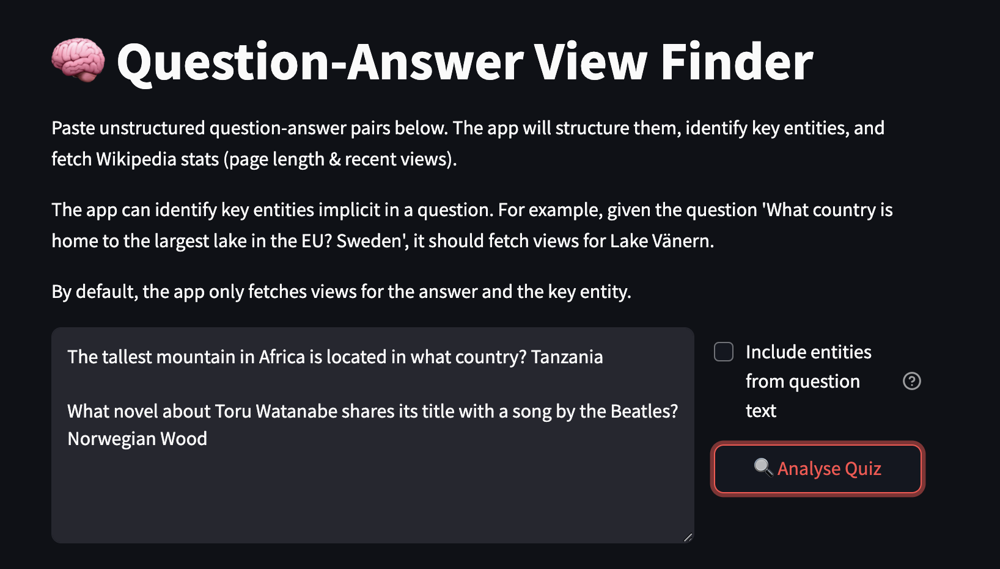
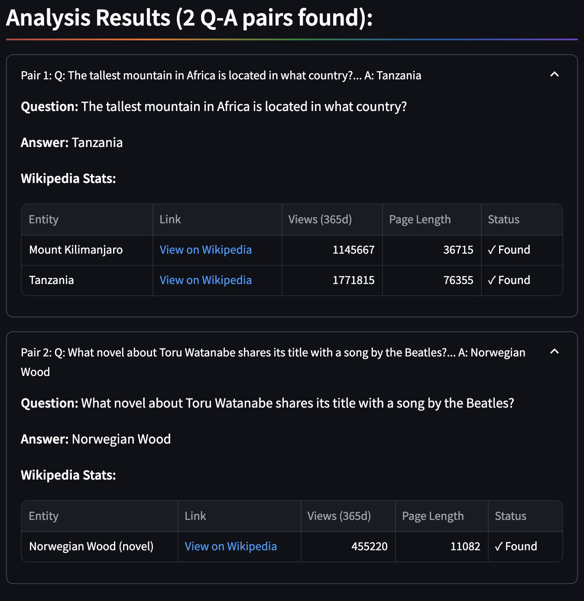

# Entity Views

A Streamlit application that analyses trivia questions and extracts Wikipedia viewership statistics for entities.

## Features

- **Entity Detection**: Identifies named entities in trivia questions and answers using SpaCy NER
- **Implicit Entity Recognition**: Uses Claude AI to identify key entities that connect questions and answers
- **Disambiguation Handling**: Automatically resolves Wikipedia disambiguation pages by selecting the most contextually relevant option
- **Wikipedia Stats**: Fetches page views over the past year and page length for detected entities

## Quick Start

1. Install requirements:
   ```
   pip install -r requirements.txt
   python -m spacy download en_core_web_lg
   ```

2. Set up Claude API key and WIKI_USER_AGENT as Streamlit secrets

3. Run the application:
   ```
   streamlit run app.py
   ```

## How It Works

Input trivia question-answer pairs, and the application will:
1. Structure unformatted Q&A pairs
2. Extract named entities
3. Identify implicit topics
4. Fetch and display Wikipedia data

## Usage Example

### Query


### Results

